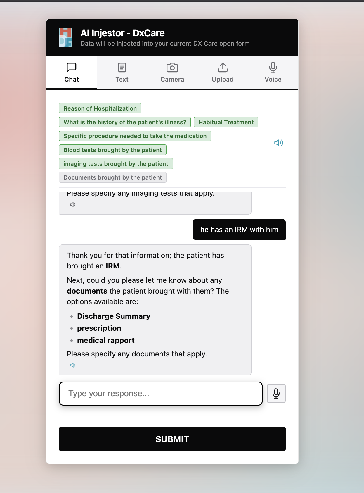
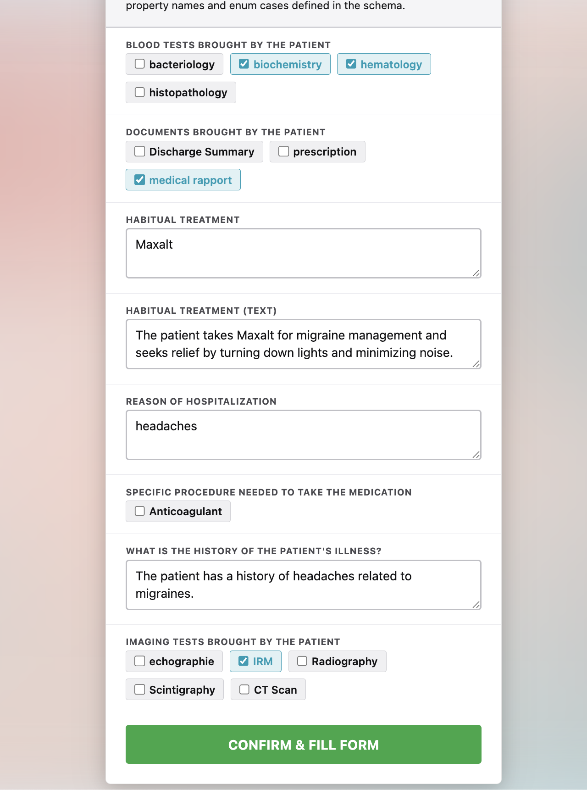
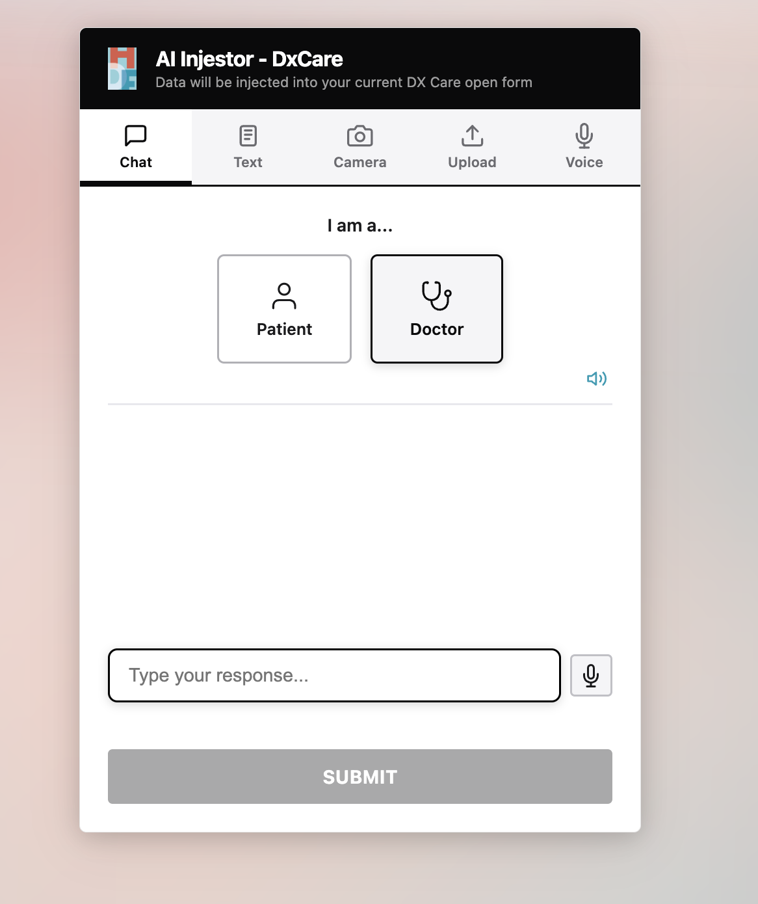
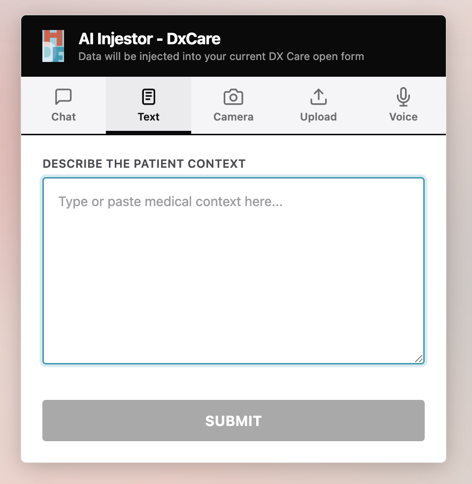
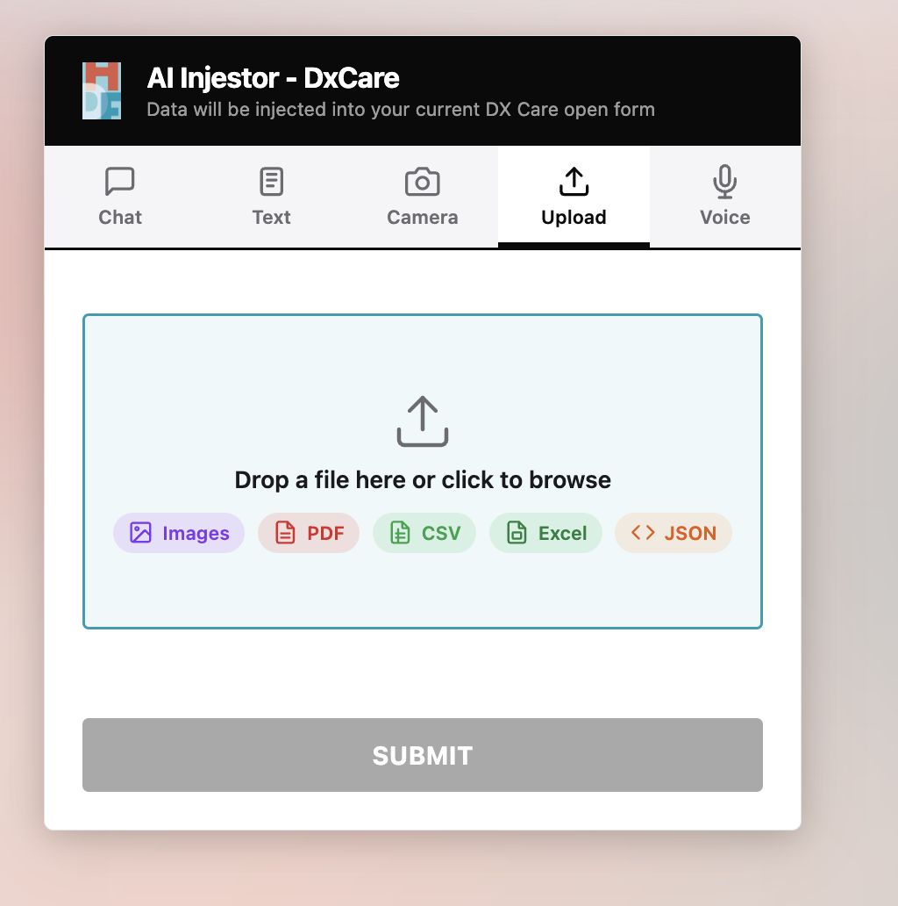
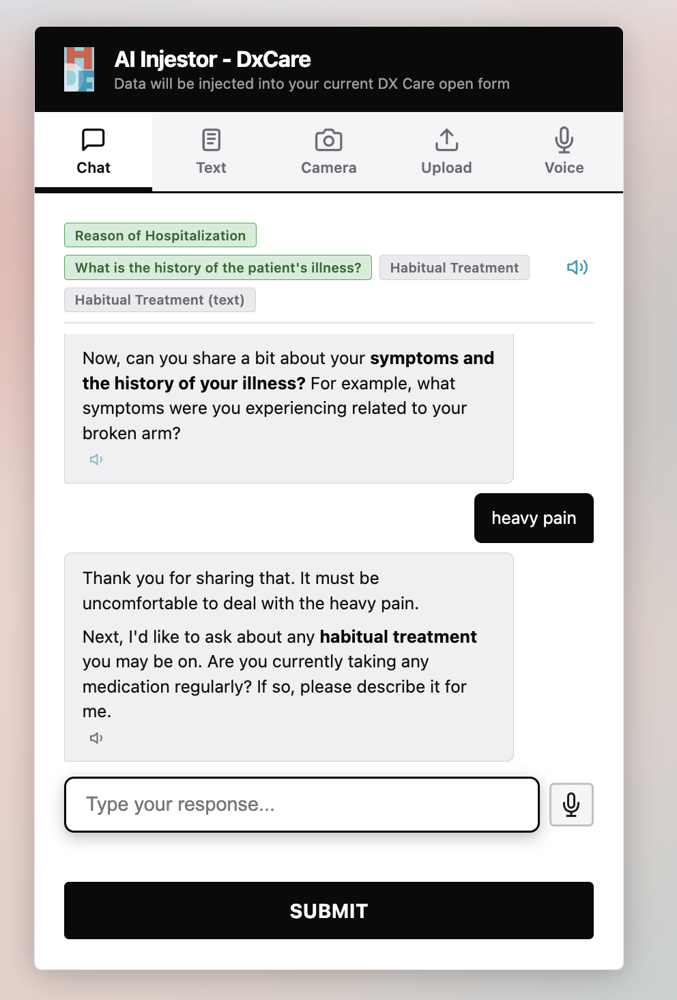
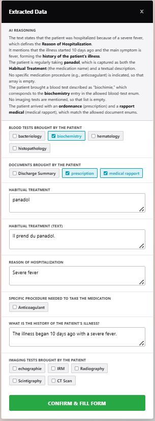
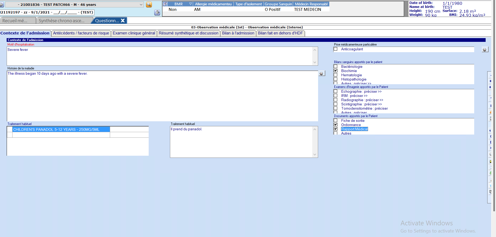
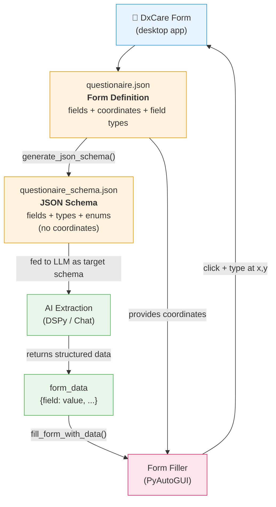

# HSante

> AI-powered medical intake automation — from any input to a filled DxCare form in seconds.




---

## The Problem

Hospital intake is slow. Clinicians manually transcribe patient information from handwritten notes, scanned documents, voice recordings, and conversations into DxCare forms — a repetitive, error-prone process that eats into care time.

## The Solution

HSante accepts **any input** — text, photos, PDFs, spreadsheets, voice recordings, or a live AI-guided conversation — extracts structured medical data using LLMs, and **automatically fills the DxCare form** via desktop automation.

---

## Features

### 5 Input Modes

#### Chat Mode — Conversational Data Collection

The flagship feature. An AI assistant conducts a structured medical interview, adapting its tone based on who it's talking to:

- **Patient mode** — friendly, empathetic, uses simple language
- **Doctor mode** — professional, concise, uses medical terminology

Real-time **field progress pills** show which data has been collected (green) and what's still needed (gray). Every AI response is streamed token-by-token and **read aloud via TTS** with a mute toggle. Users can reply by typing or tapping the **mic button** for voice input.




#### Text Mode — Paste & Parse

Paste clinical notes, referral letters, or any freeform text. The LLM extracts all relevant fields in one shot.



#### Camera Mode — Snap a Document

Point your phone camera at a prescription, lab report, or handwritten note. The app captures a photo, sends it to a vision model (Gemini 2.5 Pro), and extracts structured data from the image.


#### Upload Mode — Drag & Drop Files

Drag and drop or browse for files. Supports:

| Format | Examples |
|--------|----------|
| Images | PNG, JPG, WEBP, GIF, BMP |
| Documents | PDF (multi-page, converted page-by-page) |
| Spreadsheets | CSV, Excel (.xlsx, .xls) |
| Data | JSON |



#### Voice Mode — Record & Transcribe

Hit record, describe the patient context verbally, and the app transcribes (Deepgram Nova-3) then parses the transcript into structured fields. A live timer and animated visualizer bars give real-time feedback.

---

### Smart Extraction with Reasoning

Every extraction shows **what** was extracted and **why**. The AI provides chain-of-thought reasoning explaining its decisions, visible in an expandable section on the results card. All extracted fields are **editable** before confirmation.



---

### One-Click Form Filling

Once you confirm the extracted data, HSante switches to the DxCare window and **automatically fills every field** — text inputs, searchable dropdowns, and checkbox groups — using desktop automation (PyAutoGUI).




---

## How Form Filling Works

The core trick: we decouple **what data the form needs** from **where to click on screen** using a two-file system.



### The Two JSON Files

**`questionaire.json`** — Form Definition (with coordinates)

You map each DxCare field once by recording its pixel coordinates, field type, and label. Three field types are supported:

| Field Type | Coordinates | How it fills |
|---|---|---|
| `form_input` | Single `x, y` | Click → type value |
| `searchable_select` | `dropdown`, `input`, `result` (3 coordinate pairs) | Open dropdown → type search → click result |
| `checkbox_group` | `x, y` per option | Click each matching checkbox |

**`questionaire_schema.json`** — JSON Schema (no coordinates)

Auto-generated from the form definition by stripping out all coordinates. This is what the LLM sees — just field names, types, descriptions, and enum options. The LLM never knows about pixel positions.

### The Pipeline

1. **Map once** — Record DxCare field coordinates into `questionaire.json`
2. **Generate schema** — Run `form_schema_generator.py` to strip coordinates → `questionaire_schema.json`
3. **Extract data** — LLM parses any input against the schema → `{field: value}` dict
4. **Fill form** — `fill_form_with_data()` joins the extracted values back with coordinates and drives PyAutoGUI to click and type into DxCare

---

## Architecture

```
                    ┌─────────────────────────────────────┐
                    │           Frontend (Vanilla JS)       │
                    │  5 modes · Markdown · TTS playback    │
                    └──────────────┬──────────────────────┘
                                   │
                    ┌──────────────▼──────────────────────┐
                    │           Flask Backend               │
                    │                                       │
                    │  /parse-context ──► Parser Router     │
                    │       ├─ Text    → DSPy + GPT-OSS     │
                    │       ├─ Image   → DSPy + Gemini 2.5  │
                    │       ├─ Audio   → Deepgram STT → Text│
                    │       ├─ PDF     → PyMuPDF → Image    │
                    │       ├─ CSV/XLS → Pandas → Text      │
                    │       └─ JSON    → Text               │
                    │                                       │
                    │  /chat-*  ──► SSE streaming (GPT-4o)  │
                    │  /tts     ──► Deepgram TTS            │
                    │  /stt     ──► Deepgram STT            │
                    │  /fill-form ─► PyAutoGUI              │
                    └───────────────────────────────────────┘
                                   │
                    ┌──────────────▼──────────────────────┐
                    │         External Services             │
                    │  OpenRouter · Deepgram · Cloudflare R2│
                    └──────────────────────────────────────┘
```

## Tech Stack

| Layer | Technology |
|-------|-----------|
| Backend | Flask (Python) |
| Frontend | Vanilla JS, CSS (no frameworks) |
| LLM Orchestration | DSPy (ChainOfThought) |
| Chat Model | GPT-4o-mini via OpenRouter |
| Text Extraction | GPT-OSS-120B via OpenRouter |
| Vision | Gemini 2.5 Pro via OpenRouter |
| Voice | Deepgram (Nova-3 STT + Aura-2 TTS) |
| File Storage | Cloudflare R2 |
| Form Automation | PyAutoGUI |
| PDF Processing | PyMuPDF |
| Spreadsheets | Pandas + openpyxl |

## Getting Started

```bash
# Clone
git clone <repo-url>
cd hsante

# Install dependencies
pip install -r requirements.txt

# Set environment variables
cp .env.example .env
# Fill in: OPENROUTER_API_KEY, DEEPGRAM_API_KEY, R2 credentials

# Run
python app.py
```

Open `http://localhost:5000/form-context` in your browser.

## Medical Fields Collected

The system extracts data matching a DxCare intake like the following:

- **Reason of Hospitalization** — why the patient came
- **History of Illness** — symptoms and timeline
- **Habitual Treatment** — regular medications (structured + freetext)
- **Specific Procedures** — e.g. anticoagulant protocols
- **Blood Tests** — bacteriology, biochemistry, hematology, histopathology
- **Imaging Tests** — echography, MRI, radiography, scintigraphy, CT scan
- **Documents Brought** — discharge summaries, prescriptions, medical reports

---

*Built at a hackathon — because clinicians deserve better tools.*
